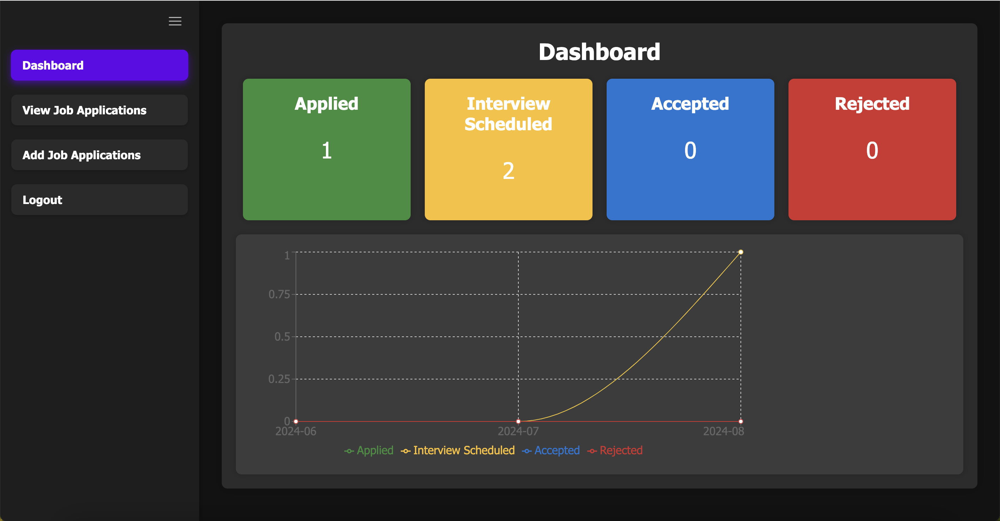
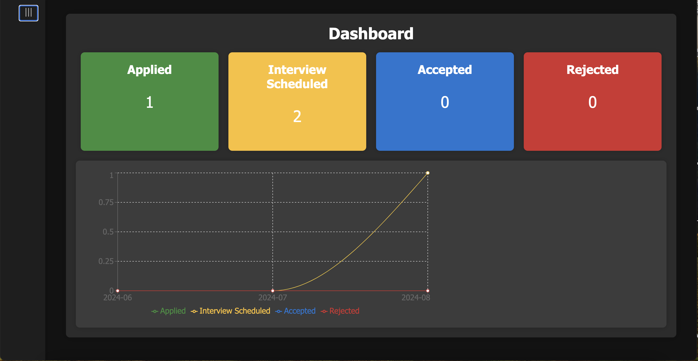
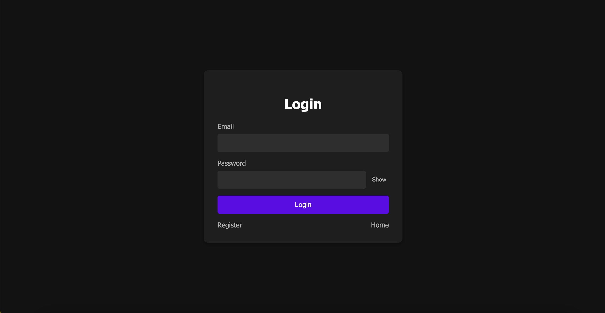
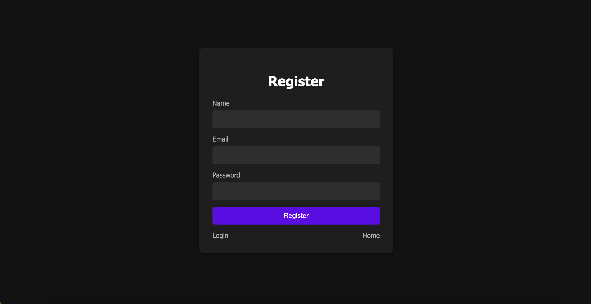
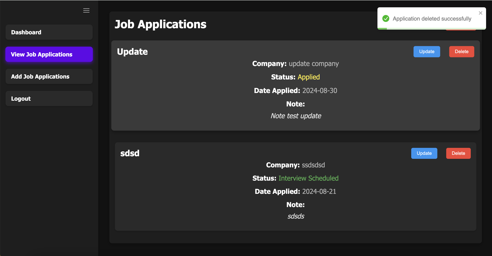
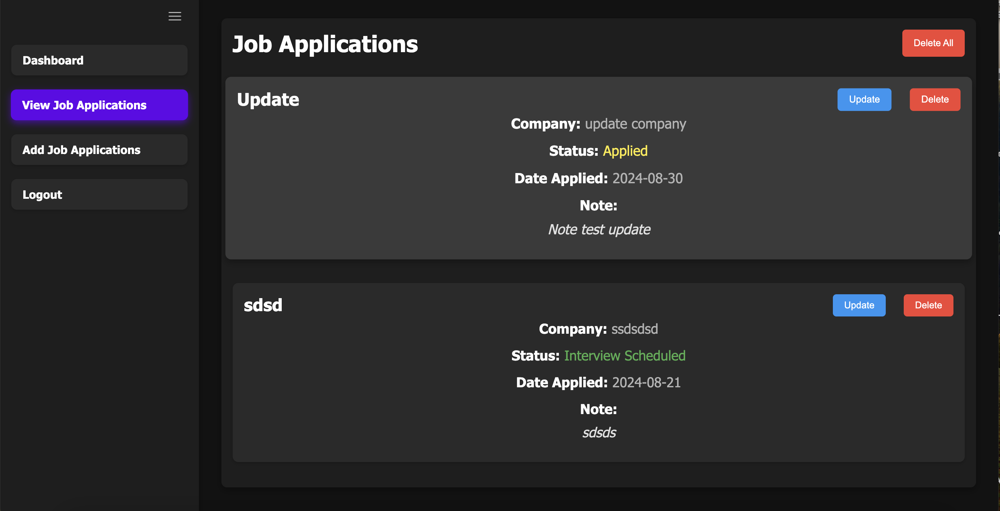
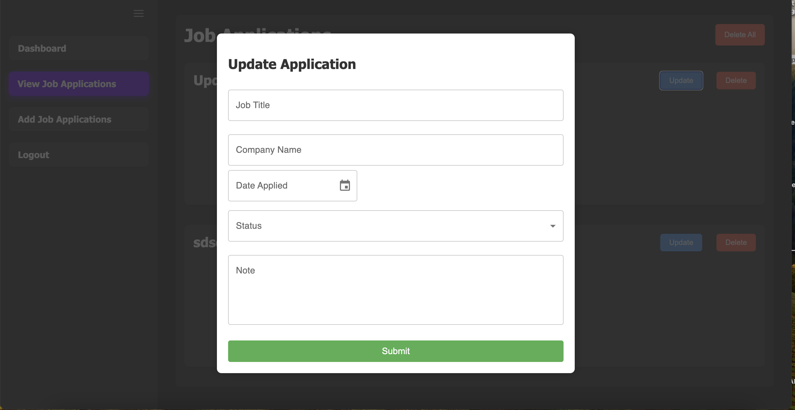
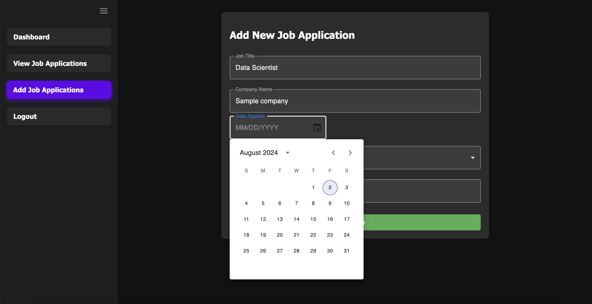
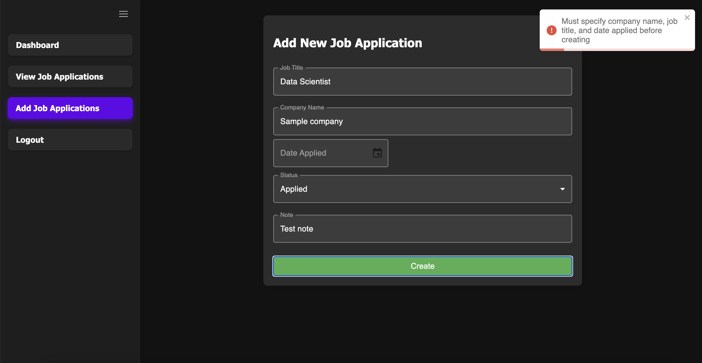

# Job Search Tracker

## Overview

This is a full stack job search tracking web application that allows users to manage their job applications. The application provides features for adding, updating, viewing, and deleting job applications. It includes a dashboard for visualizing application statuses and trends over time.

## Screenshots

### Dashboard




### Login/Registration




### View job applications





### Create Job Applications




## Features

- Add new job applications
- Update existing job applications
- View a list of all job applications
- Delete job applications
- Dashboard with visual statistics

## Technologies Used

- Backend: Node.js, Express, PostgreSQL, JWT (JSON Web Token)
- Frontend: React, Material-UI, Recharts
- Containerization: Docker, Docker Compose

# Prerequisites

- Docker
- Docker Compose

## Running the Project with Docker

### Step 1: Clone the Repository

```bash
git clone https://github.com/yourusername/job-application-tracker.git
cd job-application-tracker
```

### Step 2: Build and Run the Docker Containers

```bash
docker-compose up --build
```

### Step 3: Access the Application

Once the containers are up and running, you can access the application in your web browser at:

```bash
http://localhost:3000
```
